# Ghost Identity Hunter — Architecture

High-level architecture of the Ghost Identity Hunter (GIH) OSINT investigation platform, derived from the current source tree under `src/`.

## Table of Contents

- [1. System Context](#1-system-context)
- [2. Layered Overview](#2-layered-overview)
- [3. Overall Architecture Diagram](#3-overall-architecture-diagram)
- [4. Component / Block Diagrams per Layer](#4-component--block-diagrams-per-layer)
  - [4.1 Entry Points](#41-entry-points)
  - [4.2 Orchestration](#42-orchestration)
  - [4.3 OSINT Modules](#43-osint-modules)
  - [4.4 Plugin Subsystem](#44-plugin-subsystem)
  - [4.5 External Tools](#45-external-tools)
  - [4.6 Storage](#46-storage)
  - [4.7 Correlation](#47-correlation)
  - [4.8 Reporting and Visualization](#48-reporting-and-visualization)
  - [4.9 Analysis, Collaboration, Configuration](#49-analysis-collaboration-configuration)
- [5. Data Model](#5-data-model)
- [6. Control and Data Flow Summary](#6-control-and-data-flow-summary)
- [7. Technology Stack](#7-technology-stack)
- [8. Known Gaps and Caveats](#8-known-gaps-and-caveats)
- [9. Source Map](#9-source-map)

---

## 1. System Context

GIH takes seed identity artifacts (phone, email, username, image path) and expands them into a graph of related artifacts using built-in OSINT modules, a plugin system, and external command-line OSINT tools. Everything is persisted in a local SQLite database; results are correlated into identity profiles and rendered as HTML/JSON reports plus an interactive graph.

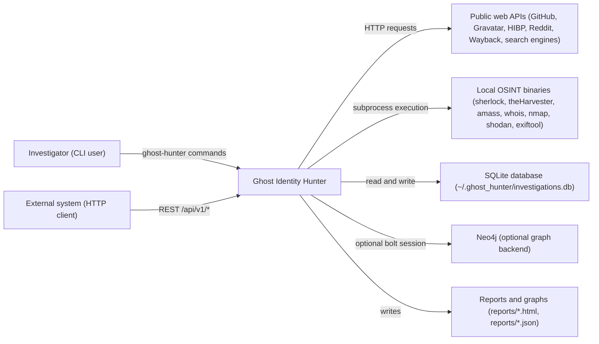

## 2. Layered Overview

| Layer | Responsibility | Key code |
| --- | --- | --- |
| Entry points | Parse user or API input, build seeds and configuration | `src/cli.py`, `src/api/workflow_api.py` |
| Orchestration | Depth-limited BFS expansion, dispatch, persistence, finalization | `src/orchestrator.py` |
| OSINT modules | Artifact-type-specific collection logic | `src/modules/*` |
| Plugins | Pluggable, discoverable collectors with a uniform interface | `src/plugins/*` |
| External tools | Subprocess wrappers around installed OSINT binaries plus availability detection | `src/modules/external_tools.py`, `src/utils/tool_checker.py` |
| Storage | SQLite schema and CRUD | `src/storage/database.py` |
| Correlation | Graph build, identity clustering, confidence and risk scoring | `src/correlation/linker.py`, `src/correlation/scorer.py`, `src/modules/correlation.py`, `src/modules/correlation_neo4j.py` |
| Reporting and visualization | Jinja2 HTML reports, JSON reports, pyvis graphs | `src/reporting/html_report.py`, `src/graph/visualizer.py` |
| Analysis and collaboration | Cross-investigation statistics, trends, patterns, comments | `src/analysis/*`, `src/collaboration/comments.py` |
| Support | Configuration loading, HTTP session management | `src/config/loader.py`, `src/utils/http_client.py` |

## 3. Overall Architecture Diagram

```mermaid
graph TD
    subgraph EntryPoints["Entry points"]
        CLI["src/cli.py (Click group: investigate, report, graph, list, correlate, plugins)"]
        API["src/api/workflow_api.py (WorkflowAPI, Flask REST)"]
    end

    subgraph Orchestration["Orchestration"]
        ORCH["src/orchestrator.py (run_investigation, BFS deque loop)"]
        PROC["_process_artifact dispatcher"]
        EXT["_process_external_tools"]
        PLUGD["_process_with_plugins"]
    end

    subgraph Modules["OSINT modules (src/modules)"]
        PHONE["phone_osint.py"]
        EMAIL["email_osint.py"]
        USER["username_search.py"]
        IMGS["image_search.py"]
        IMGM["image_match.py"]
        BREACH["breach_check.py"]
        DORKS["google_dorks.py"]
        CORRMOD["correlation.py"]
        CORRNEO["correlation_neo4j.py"]
    end

    subgraph Plugins["Plugin subsystem (src/plugins)"]
        PBASE["base.py (OSINTPlugin, Artifact, PluginResult)"]
        PREG["registry.py (PluginRegistry)"]
        PMAN["manager.py (PluginManager, ThreadPoolExecutor)"]
        PBUILT["builtins/ (21 plugins)"]
    end

    subgraph ExternalTools["External tools"]
        TOOLCHK["src/utils/tool_checker.py (ToolChecker)"]
        EXTTOOLS["src/modules/external_tools.py (ExternalToolsIntegration)"]
        BINARIES["Installed binaries and web APIs"]
    end

    subgraph Storage["Storage"]
        DB["src/storage/database.py (SQLite)"]
        NEO["Neo4j (optional)"]
    end

    subgraph Correlation["Correlation"]
        LINKER["src/correlation/linker.py (build_identity_graph, correlate_identities)"]
        SCORER["src/correlation/scorer.py (confidence and risk scoring)"]
    end

    subgraph Presentation["Reporting and visualization"]
        REPORT["src/reporting/html_report.py (generate_html_report, generate_json_report)"]
        VIZ["src/graph/visualizer.py (generate_interactive_graph, get_graph_stats)"]
    end

    subgraph Extras["Analysis and collaboration"]
        ANAP["src/analysis/pattern_recognition.py"]
        ANAS["src/analysis/statistical_analysis.py"]
        ANAT["src/analysis/trend_analysis.py"]
        COMM["src/collaboration/comments.py"]
    end

    CFG["src/config/loader.py + config/config.yaml"]
    HTTP["src/utils/http_client.py"]

    CLI --> ORCH
    API --> ORCH
    CLI --> REPORT
    CLI --> VIZ
    CLI --> LINKER
    CLI --> PREG
    API --> REPORT

    ORCH --> PROC
    PROC --> PHONE
    PROC --> EMAIL
    PROC --> USER
    PROC --> IMGS
    PROC --> IMGM
    PROC --> EXT
    PROC --> PLUGD
    EMAIL --> BREACH
    EXT --> DORKS
    EXT --> EXTTOOLS
    EXT --> TOOLCHK
    EXTTOOLS --> BINARIES
    TOOLCHK --> BINARIES

    PLUGD --> PMAN
    PMAN --> PREG
    PREG --> PBUILT
    PBUILT --> PBASE
    PBUILT --> TOOLCHK
    PBUILT --> USER
    PBUILT --> EMAIL
    PBUILT --> PHONE
    PBUILT --> IMGM

    ORCH --> DB
    ORCH --> CORRMOD
    ORCH --> CORRNEO
    CORRNEO --> NEO

    LINKER --> DB
    LINKER --> SCORER
    REPORT --> LINKER
    REPORT --> SCORER
    REPORT --> VIZ
    VIZ --> LINKER
    REPORT --> DB

    ANAP --> DB
    ANAT --> DB
    COMM --> DB

    CFG --> ORCH
    CFG --> PMAN
    CFG --> EMAIL
    CFG --> USER
    CFG --> BREACH
    CFG --> DORKS
    HTTP --> EMAIL
    HTTP --> USER
```

## 4. Component / Block Diagrams per Layer

### 4.1 Entry Points

```mermaid
graph TD
    subgraph CLIGroup["src/cli.py (Click)"]
        ROOT["cli (--verbose, --db)"]
        INV["investigate"]
        REP["report"]
        GRA["graph"]
        LST["list"]
        COR["correlate"]
        PLG["plugins (list, info, enable, disable)"]
    end

    subgraph APIGroup["src/api/workflow_api.py"]
        HEALTH["GET /api/v1/health"]
        CREATE["POST /api/v1/investigations"]
        LISTAPI["GET /api/v1/investigations"]
        GETONE["GET /api/v1/investigations/{id}"]
        RPT["GET /api/v1/investigations/{id}/report"]
        ARTS["GET /api/v1/investigations/{id}/artifacts"]
        LNKS["GET /api/v1/investigations/{id}/links"]
        RISK["GET /api/v1/investigations/{id}/risk"]
    end

    ROOT --> INV
    ROOT --> REP
    ROOT --> GRA
    ROOT --> LST
    ROOT --> COR
    ROOT --> PLG

    INV --> ORCH["run_investigation"]
    REP --> RPTGEN["generate_html_report / generate_json_report"]
    GRA --> VIZ["generate_interactive_graph / get_graph_stats"]
    COR --> LINK["correlate_identities"]
    LST --> DB["list_investigations"]
    PLG --> REG["PluginRegistry"]

    CREATE --> ORCH
    RPT --> RPTGEN
    LISTAPI --> DB
    GETONE --> DB
    ARTS --> DB
    LNKS --> DB
    RISK --> DB
```

### 4.2 Orchestration

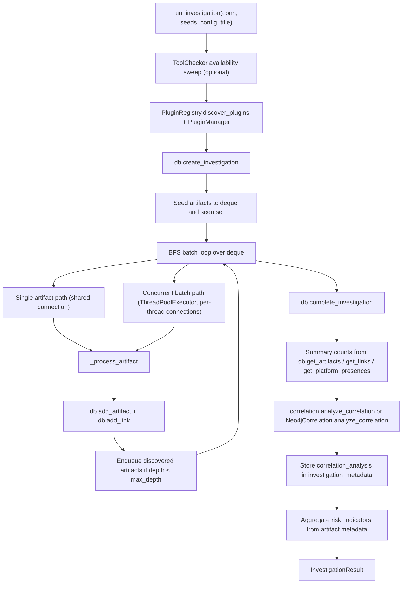

### 4.3 OSINT Modules

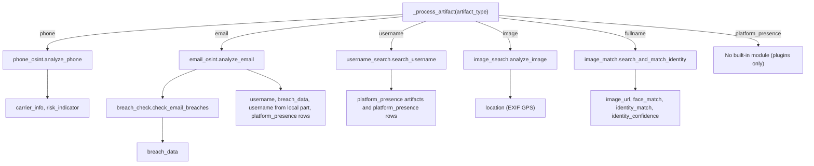

### 4.4 Plugin Subsystem

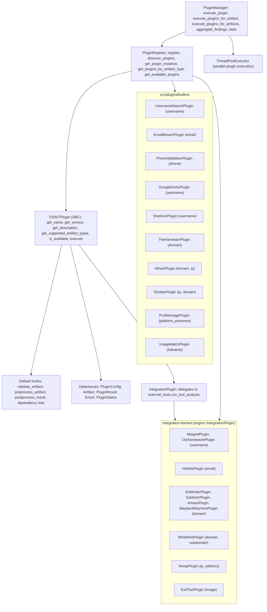

### 4.5 External Tools

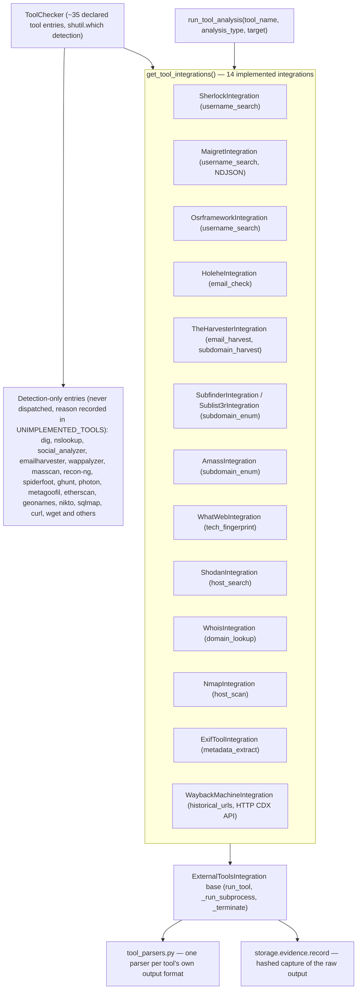

Each tool leads its own process group, so a deadline is enforced on the whole tree rather than the direct child alone; output is decoded leniently, bounded, and every failure stays inside the returned `ToolResult`.

### 4.6 Storage

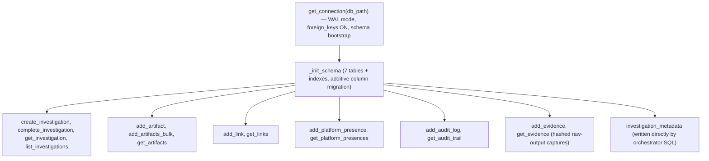

### 4.7 Correlation

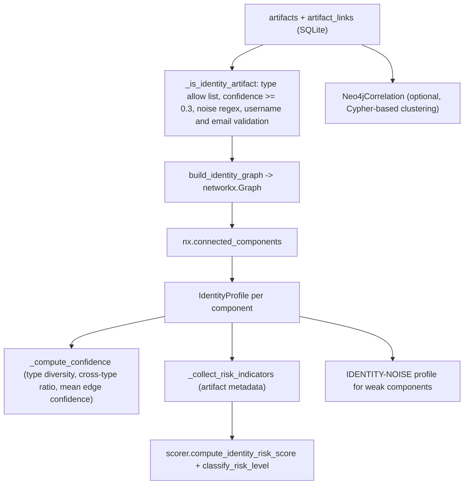

### 4.8 Reporting and Visualization

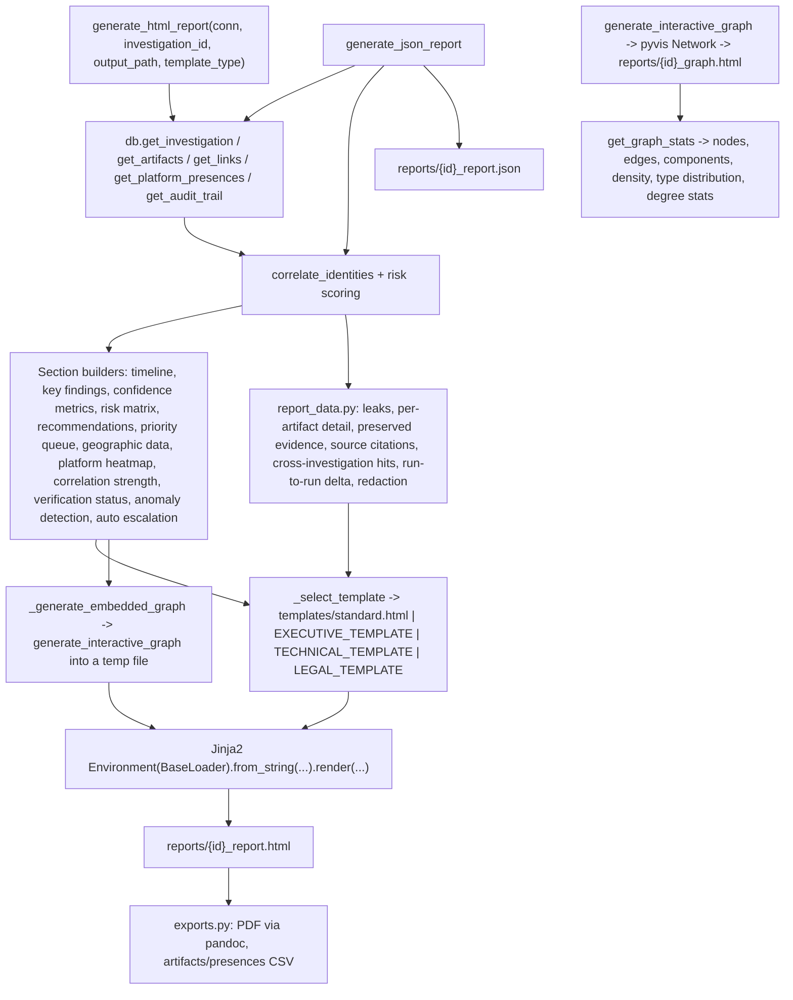

### 4.9 Analysis, Collaboration, Configuration

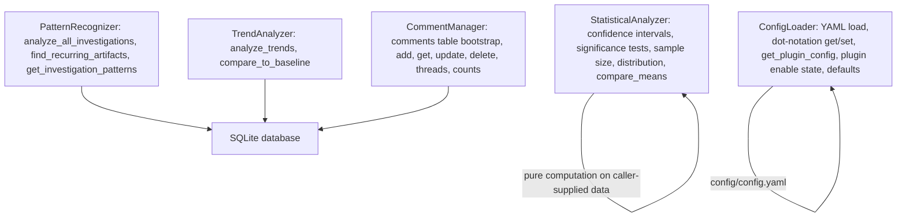

## 5. Data Model

Schema created by `_init_schema` in `src/storage/database.py`, plus the `comments` table created on demand by `CommentManager`.

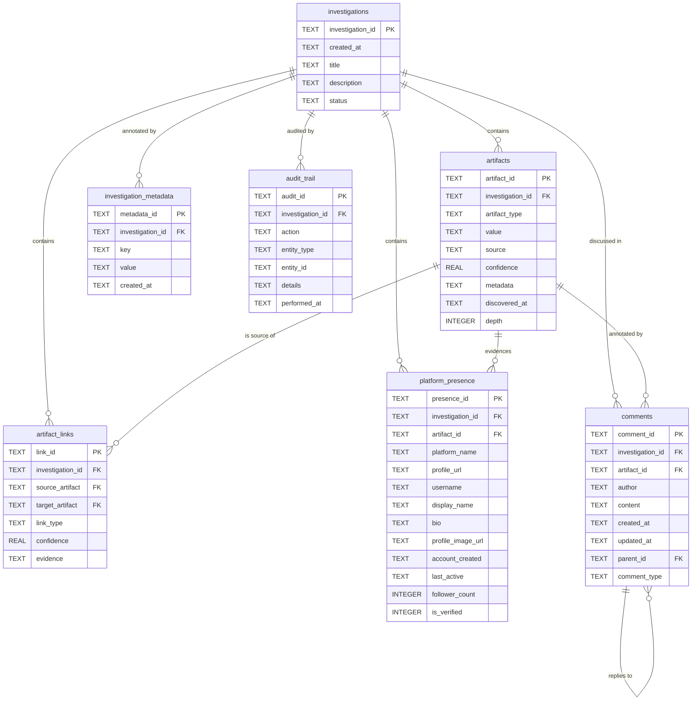

Notes on the model as implemented:

- IDs are prefixed short UUIDs: `INV-`, `ART-`, `LNK-`, `PRS-`, `AUD-`; `comments.comment_id` is a full UUID4 string.
- `add_artifact` deduplicates on `(investigation_id, artifact_type, value)` at the application level; there is no matching unique constraint in DDL. `add_link` deduplicates on `(investigation_id, source_artifact, target_artifact)` the same way.
- `metadata` on `artifacts` is a JSON string; modules write their `to_json()` payloads there.
- `investigation_metadata` is currently written only by the orchestrator (key `correlation_analysis`) using inline SQL and supplies no `metadata_id`, which conflicts with the `metadata_id TEXT PRIMARY KEY` column — see [Known Gaps](#8-known-gaps-and-caveats).
- `audit_trail` has helper functions and is read by the HTML report, but no code path writes to it during an investigation.

## 6. Control and Data Flow Summary

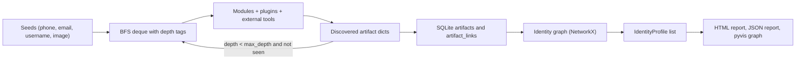

## 7. Technology Stack

| Concern | Technology | Where |
| --- | --- | --- |
| CLI | Click command groups | `src/cli.py` |
| REST API | Flask + flask-cors | `src/api/workflow_api.py` |
| Graph analysis | NetworkX (`Graph`, `connected_components`, `density`) | `src/correlation/linker.py`, `src/modules/correlation.py`, `src/graph/visualizer.py` |
| Graph visualization | pyvis `Network` (forceAtlas2Based physics, standalone HTML) | `src/graph/visualizer.py` |
| Templating | Jinja2 `Environment(BaseLoader)`; the standard template is a file, the other three are in-module strings | `src/reporting/html_report.py`, `src/reporting/templates/standard.html` |
| PDF export | pandoc over the generated HTML, with `xelatex`/`pdflatex`/`lualatex`/`wkhtmltopdf` as the engine when one is on PATH | `src/reporting/exports.py` |
| Evidence integrity | `hashlib` SHA-256 over preserved captures | `src/storage/evidence.py` |
| Persistence | SQLite (WAL journal, foreign keys on) | `src/storage/database.py` |
| Optional graph store | Neo4j via the `neo4j` bolt driver | `src/modules/correlation_neo4j.py` |
| Phone parsing | `phonenumbers` | `src/modules/phone_osint.py` |
| Image handling | Pillow EXIF, hashlib; optional `face_recognition` and `numpy` | `src/modules/image_search.py`, `src/modules/image_match.py` |
| HTTP | `requests` with a tuned session, adaptive timeout, rate limiting, UA rotation | `src/utils/http_client.py` |
| HTML parsing | BeautifulSoup (`bs4`) for search-result and profile scraping | `src/modules/google_dorks.py`, `src/plugins/builtins/profile_image_plugin.py` |
| Configuration | PyYAML via `ConfigLoader` over `config/config.yaml` | `src/config/loader.py` |
| Concurrency | `concurrent.futures.ThreadPoolExecutor` | `src/orchestrator.py`, `src/plugins/manager.py`, `src/modules/username_search.py` |
| Packaging and deployment | `pyproject.toml`, `Dockerfile`, `Dockerfile.kali`, compose files under `config/` | repository root |

## 8. Known Gaps and Caveats

Documented so the diagrams above are not read as aspirational:

1. **Declared vs. implemented external tools.** `ToolChecker` declares roughly 35 tools; 14 have real integrations in `get_tool_integrations()`. Everything else is detection-only and never executed, each with a recorded reason in `UNIMPLEMENTED_TOOLS` — `dig` and `nslookup` deliberately so, since for an email seed they profile the mail provider rather than the subject. See [LLD §5](LLD.md#5-external-tools) and [TOOL_COVERAGE.md](TOOL_COVERAGE.md).
2. **Correlation profile coverage.** `IdentityProfile` only fills `phones`, `emails`, `usernames`, `images` and derives `platforms` from `platform_presence` nodes and presence rows. `fullname` is accepted into the graph by `IDENTITY_ARTIFACT_TYPES` but has no branch that stores it on a profile, so full names contribute to `artifact_count` and confidence only.
3. **Undirected graph.** Correlation uses `networkx.Graph` and `nx.connected_components`, not a directed graph with weakly connected components; link direction from `artifact_links` is discarded when the graph is built.
4. **Partial runs.** A run that stops early raises `InvestigationAborted` and the CLI reports on what was already stored, so a report may describe an incomplete investigation; the header says so.
5. **Correlation degradation.** If graph analysis fails after the findings are stored, `_safe_correlation` returns bare counts — the report is produced, but without identity clustering or risk scores.
6. **Evidence session scope.** `storage/evidence.py` keeps one process-global capture session, so two investigations running concurrently in the same process (the HTTP API, not the CLI) share it. Captures also have no retention policy and accumulate indefinitely.
7. **API concurrency.** `WorkflowAPI` serves reports in every format the CLI does, but runs investigations in the Flask process, where the process-global evidence session (gap 6) and the shared tool-analysis cache are not per-request.
8. **CLI plugin commands.** `ghost-hunter plugins list|info` call `registry.get_plugin(...)` and read `plugin.version`, `plugin.description`, `plugin.is_enabled()`; the registry exposes `get_plugin_class`/`get_plugin_instance` and the base class exposes `get_version()`/`get_description()` with no `is_enabled`. `plugins enable|disable` mutate an in-memory dict and print a note that `config.yaml` must be edited manually.
9. **Plugin config keys.** `PluginManager` looks up config by registered class name (for example `SherlockPlugin`), while `config/config.yaml` keys are snake_case tool names (`sherlock`, `username_search`), so per-plugin YAML settings are not applied and merged defaults are used instead.
10. **Legal template scope.** The legal report's chain-of-custody claim covers the external tools and the web-archive query only, since those are what evidence preservation captures; the built-in HTTP modules are not preserved.
11. **Reports directory.** Default output paths are relative (`reports/...`), so artifacts land under the current working directory.

## 9. Source Map

| Path | Role |
| --- | --- |
| `src/cli.py` | Click CLI: `investigate`, `report`, `graph`, `list`, `correlate`, `plugins` |
| `src/api/workflow_api.py` | Flask REST wrapper around orchestration and reporting |
| `src/orchestrator.py` | BFS investigation engine and dispatcher |
| `src/modules/phone_osint.py` | Phone parsing, carrier, line type, VoIP and burner risk |
| `src/modules/email_osint.py` | Email validation, MX, disposable and privacy detection, Gravatar, GitHub, platform checks |
| `src/modules/username_search.py` | Username presence checks across configured platforms |
| `src/modules/image_search.py` | EXIF extraction, hashing, reverse-search URL generation |
| `src/modules/image_match.py` | Name-driven image search and optional face matching |
| `src/modules/breach_check.py` | HaveIBeenPwned breach and password exposure checks |
| `src/modules/google_dorks.py` | Dork pattern search over API, DuckDuckGo or scraping, with cache and backoff |
| `src/modules/external_tools.py` | Subprocess integrations for 14 external tools, with process-group lifetime control |
| `src/modules/tool_parsers.py` | One parser per tool's own output format |
| `src/modules/leakosint.py` | Keyed breach-record lookup, prioritised in the report |
| `src/modules/correlation.py` | Lightweight in-memory correlation metrics used by the orchestrator |
| `src/modules/correlation_neo4j.py` | Optional Neo4j-backed correlation and cross-investigation queries |
| `src/storage/evidence.py` | Hashed captures of raw tool output, and their verification |
| `src/reporting/report_data.py` | Derived report sections and redaction |
| `src/reporting/exports.py` | PDF and CSV output |
| `src/reporting/templates/standard.html` | Default report template |
| `src/utils/matching.py` | Strict exact-handle matching for tool findings |
| `src/plugins/base.py` | Plugin ABC and dataclasses |
| `src/plugins/registry.py` | Plugin discovery and registration |
| `src/plugins/manager.py` | Plugin execution, parallelism, statistics |
| `src/plugins/builtins/*.py` | Eleven built-in plugins |
| `src/correlation/linker.py` | Identity graph construction and clustering |
| `src/correlation/scorer.py` | Link confidence, risk score, risk level |
| `src/storage/database.py` | SQLite schema and data access |
| `src/reporting/html_report.py` | HTML and JSON report generation |
| `src/graph/visualizer.py` | pyvis interactive graph and graph statistics |
| `src/analysis/*.py` | Cross-investigation pattern, trend and statistical analysis |
| `src/collaboration/comments.py` | Comment and annotation storage |
| `src/config/loader.py` | YAML configuration loader and plugin config resolution |
| `src/utils/tool_checker.py` | External tool registry and availability detection |
| `src/utils/http_client.py` | Shared HTTP session, adaptive timeouts, rate limiting |

## Related Documents

- [LLD.md](LLD.md) — subsystem-level low-level design
- [SEQUENCE_DIAGRAMS.md](SEQUENCE_DIAGRAMS.md) — end-to-end runtime sequences
- [README.md](README.md) — documentation index
