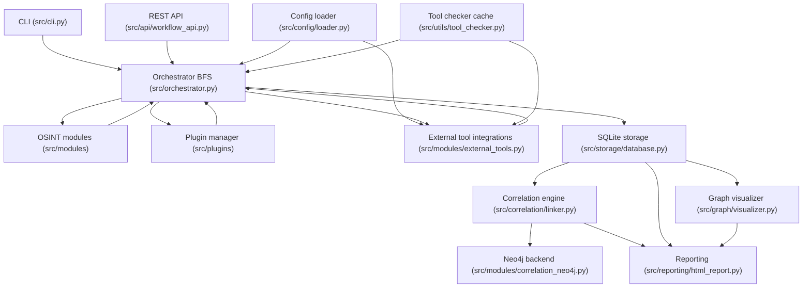
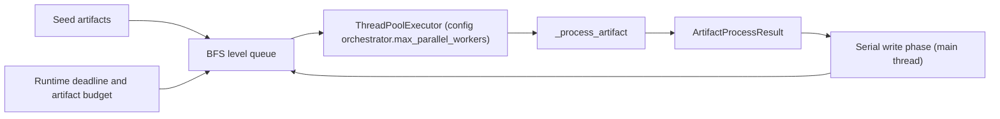
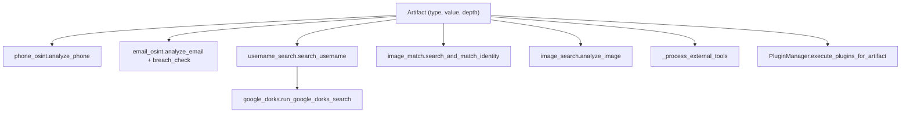
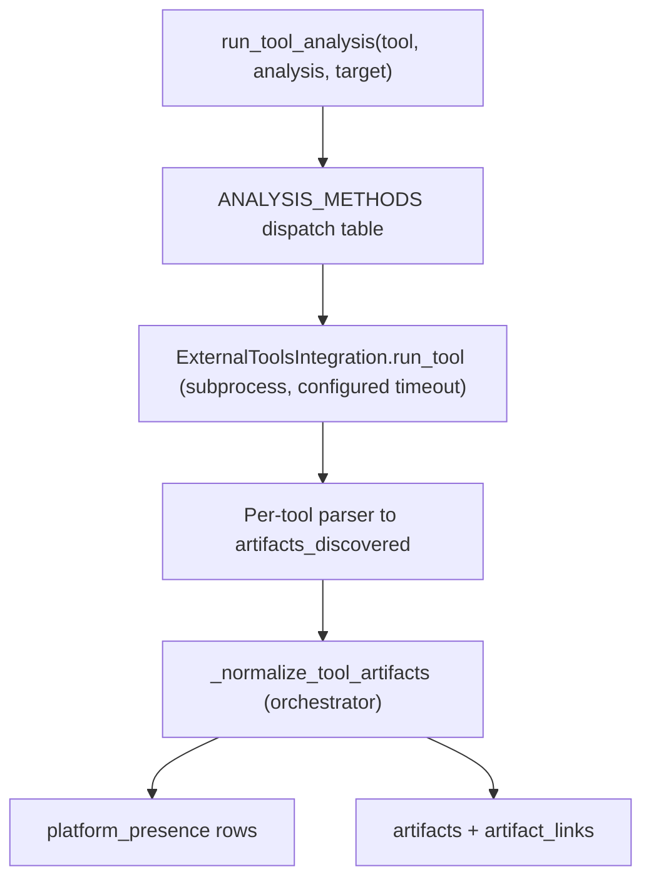
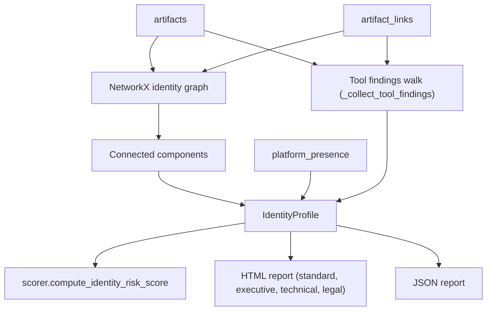
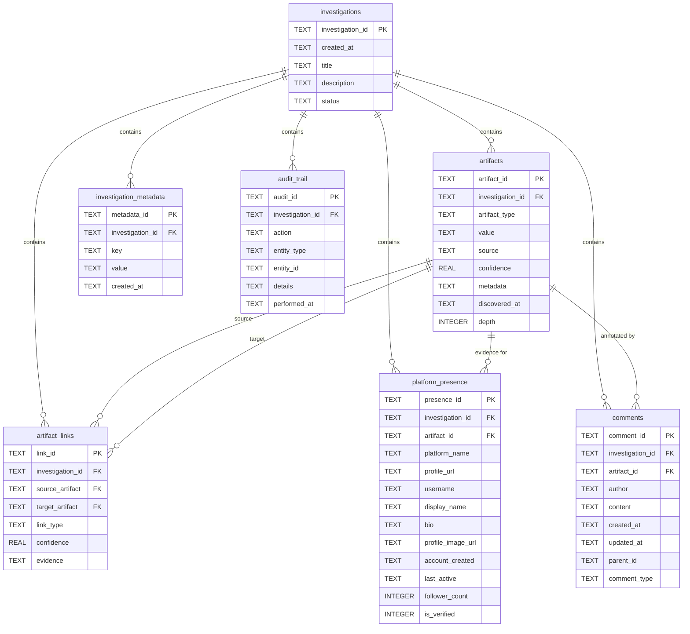

# Ghost Identity Hunter — Architecture

Ghost Identity Hunter (GIH) is an OSINT identity-attribution framework. It takes seed
artifacts (a phone number, email, username, full name, IP address or image), expands them
breadth-first through OSINT modules, plugins and external tools, persists everything to
SQLite, correlates the result into identity profiles and renders HTML/JSON reports.

- Low-level design per subsystem: [LLD.md](LLD.md)
- Which external tools are declared, implemented and invoked: [TOOL_COVERAGE.md](TOOL_COVERAGE.md)

## Layers

| Layer | Location | Responsibility |
| --- | --- | --- |
| Interface | `src/cli.py`, `src/api/workflow_api.py` | Click CLI and Flask REST API; build seeds and `InvestigationConfig` |
| Orchestration | `src/orchestrator.py` | Depth-limited BFS over artifacts, parallel per level, serialized DB writes, runtime/artifact budgets |
| Collection | `src/modules/*`, `src/plugins/*` | Native OSINT modules, plugin system, external tool subprocess integrations |
| Correlation | `src/correlation/linker.py`, `src/correlation/scorer.py`, `src/modules/correlation.py`, `src/modules/correlation_neo4j.py` | Identity graph, confidence and risk scoring, optional Neo4j backend |
| Storage | `src/storage/database.py` | SQLite schema and all reads/writes |
| Presentation | `src/reporting/html_report.py`, `src/graph/visualizer.py` | Four HTML templates, JSON report, interactive graph |
| Support | `src/config/loader.py`, `src/utils/tool_checker.py`, `src/utils/http_client.py` | YAML configuration, cached tool availability, HTTP session handling |
| Analysis extras | `src/analysis/*`, `src/collaboration/comments.py` | Pattern, statistical and trend analysis; investigation comments |

## Overall architecture

## Orchestration layer

## Collection layer

## External tools layer

## Correlation and reporting layer

## Data model

The schema is created by `_init_schema` in `src/storage/database.py` (called from
`get_connection`). All tables are keyed
by `investigation_id`; the `comments` table is created on demand by
`src/collaboration/comments.py`.

## Artifact taxonomy

`EXPANDABLE_ARTIFACT_TYPES` in `src/orchestrator.py` decides what is re-queued for further
expansion: `phone`, `email`, `username`, `image`, `fullname`, `domain`, `ip_address`.
Everything else (`username_presence`, `open_port`, `dns_a`, `historical_url`,
`gps_coordinates`, `camera_info`, `breach_data`, ...) is stored and linked as a leaf finding
so a single noisy tool cannot drive another round of expensive tool runs.

## Tech stack

| Concern | Technology |
| --- | --- |
| Language | Python 3.10+ |
| CLI | Click |
| REST API | Flask, flask-cors |
| Persistence | SQLite (`sqlite3`, WAL journal) |
| Graph analysis | NetworkX; optional Neo4j via the `neo4j` driver |
| HTTP / scraping | requests, BeautifulSoup |
| Templating | Jinja2 |
| Imaging | Pillow, NumPy; optional `face_recognition` |
| Configuration | PyYAML (`config/config.yaml`) |
| Concurrency | `concurrent.futures.ThreadPoolExecutor` |
| External tools | sherlock, maigret, holehe, theHarvester, amass, subfinder, whois, dig, nmap, shodan, exiftool, Wayback CDX API |
| Testing / lint | pytest, ruff |

## Known gaps

- `src/utils/tool_checker.py` declares 35 tools; only 12 have integrations
  (`get_tool_integrations`) and the rest are unimplemented. See
  [TOOL_COVERAGE.md](TOOL_COVERAGE.md).
- Shodan requires an API key and its CLI output is parsed as JSON, so it stays unverified in
  environments without a key.
- The identity graph itself is still built only from `phone`, `email`, `username`, `image`
  and `fullname` artifacts. Tool findings are attached to profiles by walking links
  (`_collect_tool_findings`) rather than by joining the graph, so a finding is only surfaced
  when it is within `MAX_FINDING_HOPS` of an identity artifact.
- `face_recognition` is optional; without it, image matching degrades to URL collection and
  EXIF analysis.
- Google Dorks scraping depends on search-engine HTML and is disabled by default.
