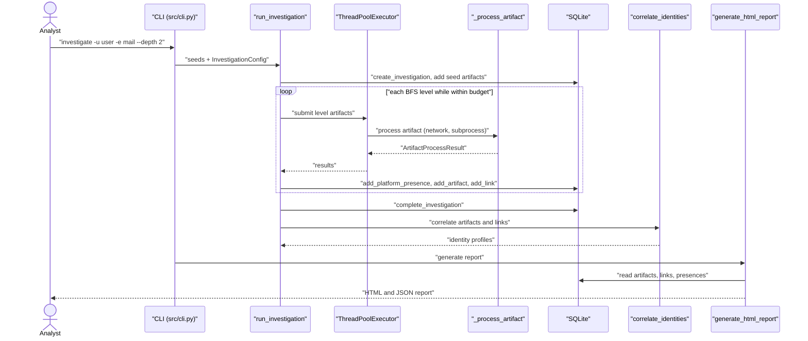
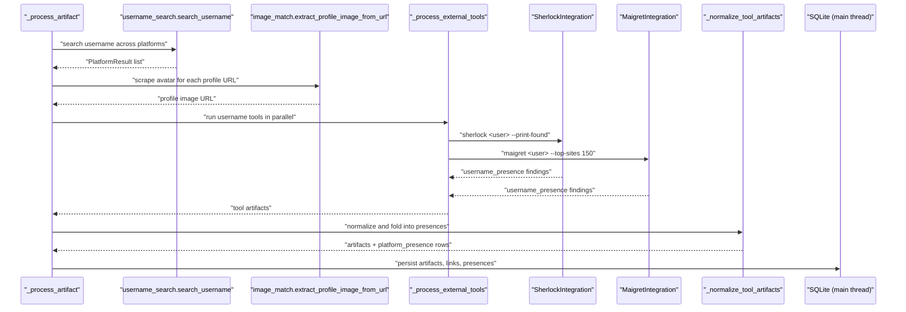
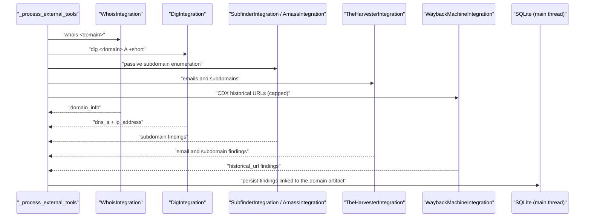
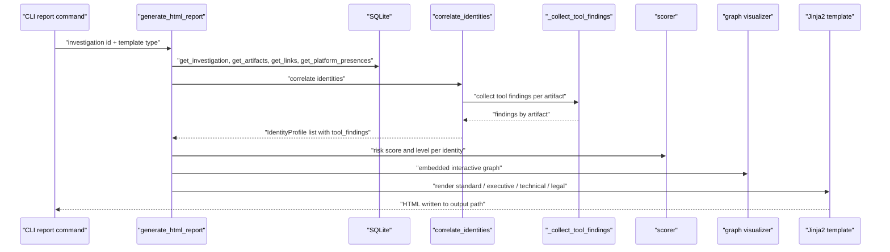

# Ghost Identity Hunter — Low Level Design

Companion to [ARCHITECTURE.md](ARCHITECTURE.md). Every section below describes what the code
in the referenced module actually does.

## 1. Orchestrator and the BFS pipeline

`src/orchestrator.py`

### Configuration

`InvestigationConfig` carries the run parameters: `max_depth` (default `MAX_DEPTH`), module
toggles (`check_breaches`, `search_usernames`, `check_images`, `check_external_tools`), Neo4j
settings, Google Dorks settings, and the three bounds that keep a run inside its time budget:

| Field | Config key (`config/config.yaml`) | Purpose |
| --- | --- | --- |
| `max_runtime_minutes` | `investigation.max_runtime_minutes` | Wall-clock deadline checked before each BFS level |
| `max_total_artifacts` | `investigation.max_total_artifacts` | Cap on distinct artifacts enqueued |
| `max_parallel_workers` | `investigation.max_parallel_workers` / `orchestrator.max_parallel_workers` | Per-level thread pool size |

### Level-parallel BFS with serialized writes

`run_investigation` processes the queue one depth level at a time:

1. Seed artifacts are written and pushed onto the queue at depth 0.
2. Before each level the elapsed time is compared against `max_runtime_minutes`; exceeding it
   ends the traversal and the investigation still completes and reports.
3. The level is submitted to a `ThreadPoolExecutor` sized `min(max_parallel_workers, level_size)`.
   Each worker runs `_process_artifact`, which performs only network and subprocess work and
   returns an `ArtifactProcessResult` describing the intended mutations
   (`discovered`, `source_metadata`, `platform_presences`).
4. Back on the main thread the results are applied serially against the single SQLite
   connection: metadata `UPDATE`, `db.add_platform_presence`, then for each discovery
   `db.add_artifact` plus `db.add_link`. The `seen` set (`type:value`) dedupes across the whole
   run and the artifact budget is enforced here.
5. Only artifact types in `EXPANDABLE_ARTIFACT_TYPES` are re-queued; leaf findings are stored
   and linked but never expanded.

This split is the reason there are no `sqlite3` thread-safety workarounds: workers never touch
the connection.

### Per-type dispatch

`_process_artifact` routes on `artifact["type"]` to `_process_phone`, `_process_email`,
`_process_username`, `_process_fullname`, `_process_image`, then always runs
`_process_external_tools` (when enabled) and the plugin manager. Tool output passes through
`_normalize_tool_artifacts` before persistence:

- keys that map to artifact columns (`type`, `value`, `source`, `confidence`, `metadata`,
  `link_type`) are kept as-is;
- everything else a tool reports (`platform`, `service`, `protocol`, `timestamp`, ...) is merged
  into the artifact's JSON `metadata`;
- `username_presence` findings additionally become `platform_presence` rows (deduped by profile
  URL) and are keyed by profile URL so two platforms are not collapsed into one artifact.

## 2. OSINT modules

`src/modules/`

| Module | Entry point | Produces |
| --- | --- | --- |
| `phone_osint.py` | `analyze_phone` | carrier, region, line type, `voip_number` / `invalid_number` risk indicators |
| `email_osint.py` | `analyze_email` | validity, Gravatar hash/URL, GitHub profile, HIBP hits, derived `username` and `domain` |
| `breach_check.py` | `check_email_breaches` | `breach_data` artifacts, `found_in_N_breaches` indicators |
| `username_search.py` | `search_username` | `platform_presence` rows across the configured platform list, checked with a thread pool |
| `image_search.py` | `analyze_image` | EXIF, GPS `location`, hashes, reverse-search URLs |
| `image_match.py` | `search_and_match_identity`, `extract_profile_image_from_url` | candidate images for a full name; scraped avatar for a profile URL |
| `google_dorks.py` | `run_google_dorks_search` | additional profile URLs / usernames (disabled by default, retry and result caps applied) |

Profile images: `_process_username` prefers the platform's `avatar_url` and otherwise scrapes
`extract_profile_image_from_url(profile_url)`. The URL is stored both on the
`platform_presence` row (`profile_image_url`) and as an `image` artifact linked with
`has_profile_image`, which is what makes `identity.images[0]` render in the report.

## 3. Plugin system

`src/plugins/`

- `base.py` — `OSINTPlugin` ABC (`get_name`, `get_supported_artifact_types`, `is_available`,
  `execute`), plus `Artifact`, `PluginConfig`, `PluginResult`, `PluginStatus`.
- `registry.py` — name-to-class registry with a global instance.
- `manager.py` — `execute_plugin` (honours `plugins.<name>.enabled` from config),
  `execute_plugins_for_artifact`, `execute_plugins_for_artifacts` (thread pool), plus
  per-plugin execution statistics.
- `builtins/` — whois, dig, shodan, sherlock, theHarvester, username search, email breach,
  image match, profile image, phone validation and Google Dorks plugins.

Plugins are a second, configuration-driven collection path that runs alongside the direct
module calls; their findings are aggregated into the same `discovered` list.

## 4. External tool integrations

`src/modules/external_tools.py`

- `ExternalToolsIntegration.run_tool(tool_name, command, timeout=None)` runs the binary with
  `subprocess.run`, capturing stdout+stderr. When `timeout` is `None` the per-tool value from
  `config/config.yaml` (`tools.<name>.timeout`) is used via `_get_tool_timeout`.
- Every integration method is wrapped in `@skip_if_not_available("<tool>")`, which consults the
  process-wide cache in `src/utils/tool_checker.py` and returns `None` when the binary is absent.
- `ANALYSIS_METHODS` maps `(tool, analysis_type)` to the *unbound* integration method.
  Binding eagerly (the previous implementation) evaluated attributes of unrelated integrations
  and made every dispatch fail with `AttributeError`.
- Parsers: `_parse_found_lines` handles the shared `"[+] Site: url"` output of sherlock and
  maigret; holehe lines are filtered to service hostnames; subfinder output is restricted to
  subdomains of the requested domain; dig A records additionally emit an `ip_address` artifact
  so nmap/Shodan have an input; the Wayback CDX query is capped at `MAX_WAYBACK_URLS`.

See [TOOL_COVERAGE.md](TOOL_COVERAGE.md) for declared-versus-implemented status.

## 5. Correlation engine

`src/correlation/linker.py`

1. `build_identity_graph` loads artifacts and links, keeps only identity-bearing artifacts
   (`IDENTITY_ARTIFACT_TYPES` = phone, email, username, image, fullname, plus
   `platform_presence`) above `MIN_ARTIFACT_CONFIDENCE`, and filters noise values
   (`_is_noise_value`, `_is_valid_username`).
2. `correlate_identities` takes connected components; each component becomes an
   `IdentityProfile` with typed lists (`phones`, `emails`, `usernames`, `images`, `platforms`),
   `risk_indicators`, `confidence` and `artifact_count`. Weak components collapse into
   `IDENTITY-NOISE`.
3. `_collect_tool_findings` walks `artifact_links` from every artifact up to
   `MAX_FINDING_HOPS` hops, through intermediate non-tool artifacts, and collects targets whose
   type is in `TOOL_ARTIFACT_TYPES`. This is how `email -> domain -> dns_a` reaches the identity.
   Findings are bucketed per type on `IdentityProfile.tool_findings` (capped by
   `MAX_FINDINGS_PER_TYPE`) and exposed for templates via `tool_finding_sections`, which pairs
   each type with a human label.

`src/correlation/scorer.py` provides `compute_link_confidence` (base score per link type with
freshness decay and source reliability), `compute_identity_risk_score` (weighted indicators,
capped at 1.0, with special handling for `found_in_N_breaches`) and `classify_risk_level`
(critical / high / medium / low thresholds).

`src/modules/correlation_neo4j.py` mirrors the NetworkX analysis against Neo4j when
`use_neo4j` is set; `run_investigation` falls back to NetworkX if the connection fails.

## 6. Storage

`src/storage/database.py` owns the schema (`_init_schema`) and every query. Notable behaviour:

- `get_connection` enables `row_factory`, foreign keys and WAL, and creates the schema.
- `add_artifact` is idempotent per `(investigation_id, artifact_type, value)`.
- `add_link` deduplicates identical source/target/type triples.
- `add_platform_presence` accepts `platform_name` positionally after the investigation id and
  stores `profile_image_url` and the optional owning `artifact_id`.
- `investigation_metadata` holds the serialized correlation analysis; `audit_trail` records
  actions.

## 7. Reporting and visualization

`src/reporting/html_report.py` renders four Jinja2 templates — standard, executive, technical
and legal — from the same context (`investigation`, `artifacts`, `links`, `presences`,
`correlation`, `risk_levels`, `timeline`, `key_findings`, `confidence_metrics`, `risk_matrix`,
`recommendations`, `priority_queue`, `geographic_data`, `platform_heatmap`, `graph_html`).
Each template renders `identity.tool_finding_sections` per identity: a findings table in the
standard and technical reports, a per-identity digest in the executive summary, and an evidence
table in the legal report. Profile images use an `onerror` handler that hides broken URLs, so a
missing image degrades silently rather than showing a broken icon. `generate_json_report`
serializes the same data, including `tool_findings`, via `IdentityProfile.to_dict`.

`src/graph/visualizer.py` builds the interactive network HTML that is embedded into the
standard report by `_generate_embedded_graph`.

## 8. Analysis, API and collaboration

- `src/analysis/pattern_recognition.py` — `PatternRecognizer` detects recurring artifact
  patterns and returns `PatternAnalysis`.
- `src/analysis/statistical_analysis.py` — `StatisticalAnalyzer` computes confidence intervals
  and significance tests.
- `src/analysis/trend_analysis.py` — `TrendAnalyzer` summarizes discovery trends over time.
- `src/api/workflow_api.py` — Flask `WorkflowAPI` exposing `/api/v1/health`,
  `/api/v1/investigations` (POST/GET), `/api/v1/investigations/<id>`, `.../report`,
  `.../artifacts`, `.../links` and `.../risk`, with an API-key check in `_authenticate`.
- `src/collaboration/comments.py` — `CommentManager` creates its own `comments` table and
  supports threaded comments and annotations bound to an investigation or artifact.

## 9. Sequence diagrams

### End-to-end investigation

### Username path

### Domain path

### Report generation path

## 10. Failure handling

- Missing binaries: `skip_if_not_available` returns `None`, `run_tool_analysis` converts that
  into an unsuccessful `ToolResult` with a "not installed" message; the investigation continues.
- Tool timeouts: `subprocess.TimeoutExpired` is captured into `ToolResult.error_message`.
- Worker exceptions: `run_investigation` logs the artifact that failed and processes the rest of
  the level.
- Neo4j connection failure: correlation falls back to NetworkX.
- Missing `face_recognition`: image matching logs a warning and continues without face encoding.
