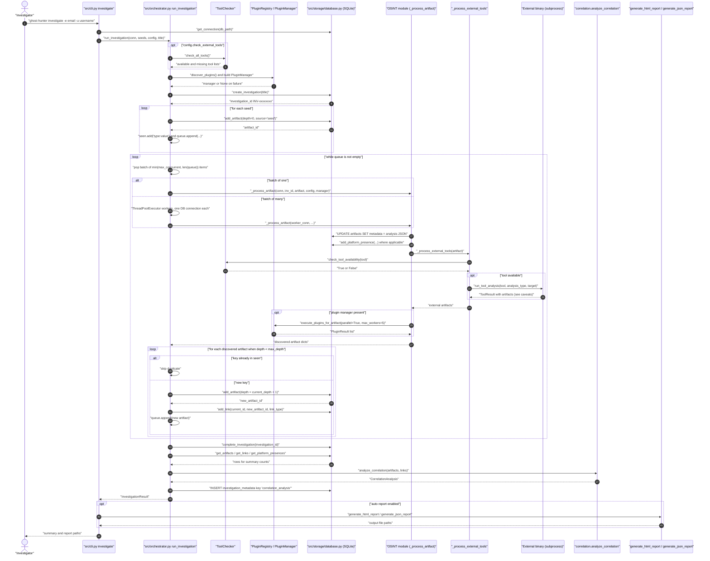
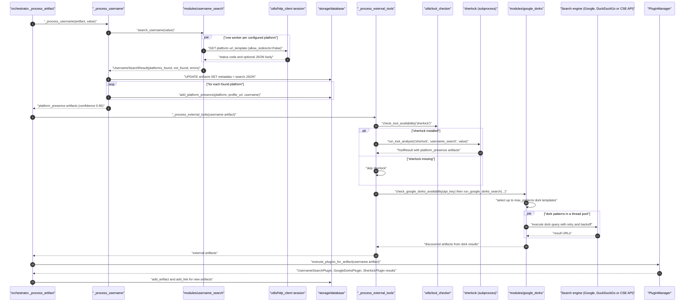
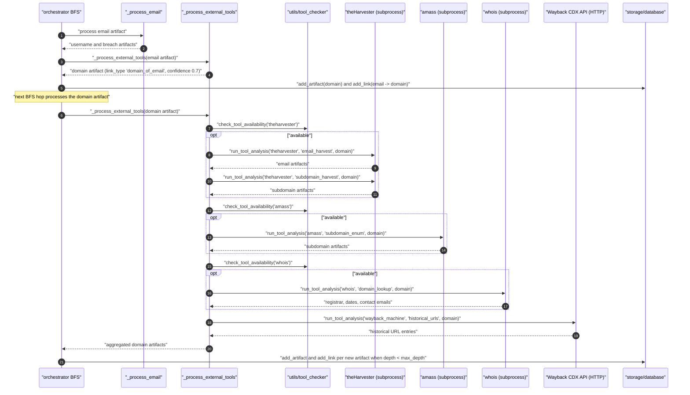
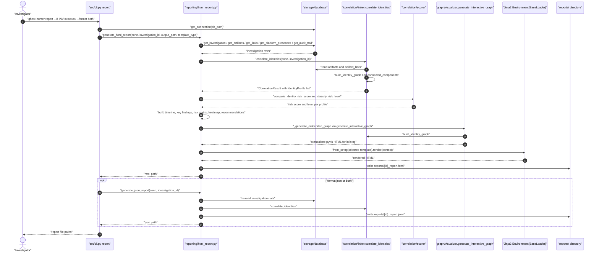

# Ghost Identity Hunter — Sequence Diagrams

Runtime sequences for the main flows, matching the code in `src/`. All diagrams are Mermaid `sequenceDiagram` blocks with double-quoted labels and no colours.

## Table of Contents

- [1. End-to-End Investigation](#1-end-to-end-investigation)
- [2. Username Investigation Path](#2-username-investigation-path)
- [3. Domain Investigation Path](#3-domain-investigation-path)
- [4. Report Generation Path](#4-report-generation-path)
- [5. Notes and Caveats](#5-notes-and-caveats)

---

## 1. End-to-End Investigation

CLI `investigate` through BFS expansion, persistence, correlation and report generation.

## 2. Username Investigation Path

Username seed: built-in platform search, Sherlock and Google Dorks.

## 3. Domain Investigation Path

Domain artifacts are synthesised from emails, then expanded with the domain tool chain.

## 4. Report Generation Path

## 5. Notes and Caveats

- **External tool dispatch**: `run_tool_analysis` currently raises `AttributeError` while building its dispatch table, and the orchestrator swallows the exception, so in practice the subprocess interactions in diagrams 1 and 3 produce no artifacts until that function is fixed. See [LLD §5.3](LLD.md#53-run_tool_analysis).
- **Google Dorks gating**: `check_google_dorks_availability` always returns `True`, so the dork branch in diagram 2 runs for every username regardless of `--use-google-dorks`.
- **Breach data**: without a HaveIBeenPwned API key, `check_email_breaches` returns mock breaches, which is the default path in diagram 3.
- **Depth cutoff**: artifacts discovered when `current_depth == max_depth` are dropped before persistence, so the final BFS hop performs collection without storing new nodes.
- **Correlation direction**: `correlate_identities` uses an undirected graph, so the `source_artifact` / `target_artifact` orientation persisted by `add_link` does not affect clustering.

## Related Documents

- [ARCHITECTURE.md](ARCHITECTURE.md)
- [LLD.md](LLD.md)
- [README.md](README.md)
